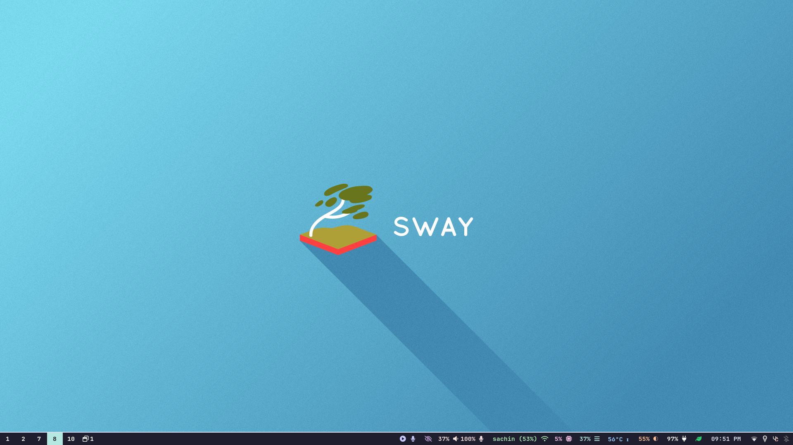
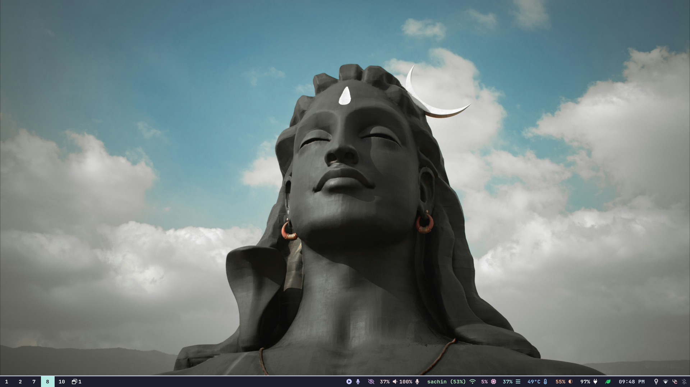
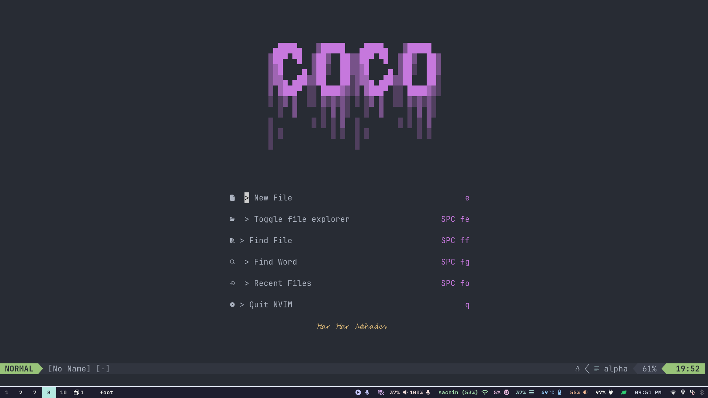

# NixOS Dotfiles

Welcome to my NixOS configuration! This repository contains my dotfiles and system configuration, managed using Nix flakes.

## ⚠️ Disclaimer

This repository contains my personal NixOS configuration tailored specifically to my workflow and preferences. While you're welcome to explore, use, or fork this configuration, please be aware that:

- These configurations are optimized for my specific hardware and use cases
- I make no guarantees about stability or compatibility with your system
- Some customizations might be highly opinionated

Use at your own risk! If you encounter issues while adapting this configuration, I may not be able to provide support.

## Table of Contents

- [Overview](#overview)
- [Screenshots](#Screenshots)
- [Features](#features)

## Overview

This repository contains my personal NixOS configuration and dotfiles. It’s designed to be minimal, efficient, and reproducible, leveraging the power of Nix flakes to manage everything from system packages to user environments.

## Screenshots

### swaywm

### neovim

## Features

### minimal sway setup with many utils

### neovim preconfigured with basic to some advance stuff

### many tools like zoxide, startship etc preconfigured minimally

